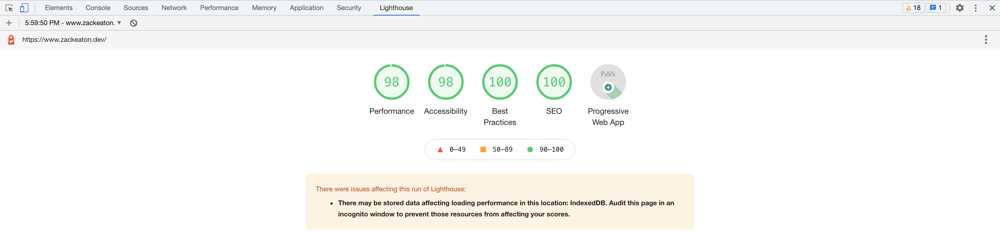

See me [live!](zack-eaton-gatsby-portfolio.netlify.app/)

---

<!-- ### Badges of Honor

 -->
---

## Usage

`npm i -g gatsby-cli`\
`gatsby new your-site-name https://github.com/surudhb/gatsby-personal-site-template.git`\
`cd your-site-name && gatsby develop`

## 📋 Starter README

- A Gatsby starter for a minimalist portfolio with `SEO` and app theming using `React Context`, `Bootstrap` and `Sass`
- I highly recommend going through Gatsby's [tutorial](https://www.gatsbyjs.org/tutorial/) before getting started.

### What does this starter offer?

- The starter is based off of the official [hello-world](https://github.com/gatsbyjs/gatsby-starter-hello-world) starter provided.
- Everything in the starter is reconfigurable.
- This starter is really a demonstation of what Gatsby is capable of.
- Built in support for `SEO`, light/dark mode and `bootstrap`
- Starter comes with a locally hosted font `Aurebesh`, but feel free to remove/replace it
- Starter uses fontawesome icons for affiliate links
- Starter uses `gatsby-node.js` and Markdown files to programatically create pages for blog posts and projects
- Starter uses `siteMetadata` to create `About` page

### The file structure is as follows:

- **Components**: Re-usable components to be used throughout the app
- **Content**: Contains relevant markdown files and images for blog posts or projects
- **Templates**: Contains files that create the template html for a blog post or project details page
- **Styles**: Contains the sass files used for adding custom styling to the app
- **Utils**: Contains helper files, seo, and theme management
- **Pages**: Contains the different pages
- **Static**: Contains static assets (i.e. self-hosted fonts or images) that bypass gatsby pipeline

### Understanding important dependencies:

- Gatbsy recommends using its plugins whenever possible, but not always. See [documentation](https://www.gatsbyjs.org/docs/plugins/) for more details.
- Gatsby plugins are used by Gatsby's build process and provide and API for certain tasks.
- `Bootstrap` is a CSS framework that comes with already defined CSS classes
- `React Bootstrap` is an abstraction of `Bootstrap` providing some basic styling built-in to its components
- `Helmet` is used to add SEO to the site making it easier for search engines to relate search keywords to your website.
- `Fontawesome` is used for icons
- `Howler` is used to manage audio files

### Credits

- Star Wars icons: https://icons8.com/icons/
- Using Context API with Gatsby: https://www.gatsbyjs.org/blog/2019-01-31-using-react-context-api-with-gatsby/
- SEO with Gatsby: https://gregberge.com/blog/gatsby-seo
- Gatsby: https://www.gatsbyjs.org/docs/

### Lighthouse screenshots

### App Screenshots

Light Mode\

  
Dark Mode\

